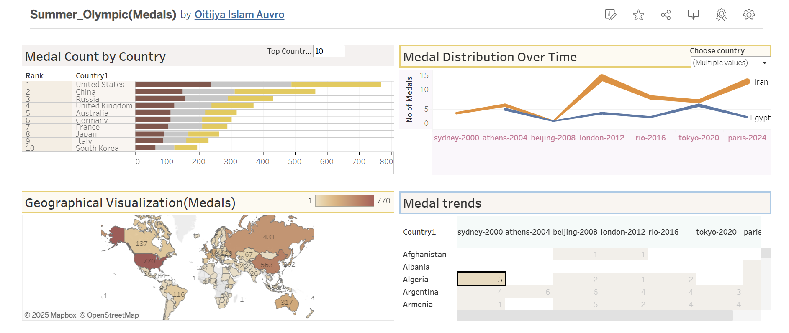
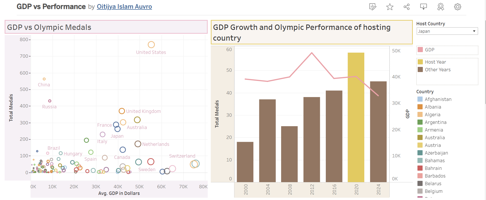

# Olympic-vs-Gdp
# **GDP vs Olympic Performance: Analyzing Economic and Athletic Success**  

## **Problem Statement**  

The goal of this project is to analyze the relationship between a country's GDP and its Olympic performance, as well as the economic impact of hosting the Olympics. We gathered data on Olympic medal counts and GDP from various sources and visualized key insights using Tableau Dashboards.  

Through our analysis, we aimed to answer the following questions:  

1. **Does the host nation win more medals than usual ?**  
2. **Does a country's economy experience a boost after hosting the Olympics?**  
3. **Do wealthier nations (higher GDP) tend to perform better in the Olympics?**  
4. **As a country's GDP grows, does its medal count also increase over time?**

   
## **Tableau Dashboards Preview**


## **Tableau Dashboards**  
You can explore our visualizations here:  
- [**Summer Olympic Medals Dashboard**](https://public.tableau.com/app/profile/oitijya.islam.auvro/viz/Summer_OlympicMedals/Dashboard1)  
- [**GDP vs. Olympic Performance Dashboard**](https://public.tableau.com/app/profile/oitijya.islam.auvro/viz/GDPvsPerformance/Dashboard2)  

## **Data Sources**  
- **Olympic Medal Data:** [Olympics Official Website](https://www.olympics.com/en/olympic-games/paris-2024/medals)  
- **GDP per Capita Data:** [Wikipedia - Past & Projected GDP](https://en.wikipedia.org/wiki/List_of_countries_by_past_and_projected_GDP_(nominal)_per_capita)  

## **Key Findings from the Dashboards**  

1. **The USA consistently performs well even without hosting the Olympics.**  
2. **Countries with strong Olympic performances** include Italy, Australia, Germany, China, and Russia, while no Middle Eastern nation has shown consistent success.  
3. **GDP does not always correlate with Olympic success:**  
   - Despite having one of the highest GDP per capita, Norway and Switzerland do not perform exceptionally well.  
   - Conversely, countries like Brazil, Ukraine, and Russia have achieved strong Olympic results despite lower GDP per capita.  
4. **France leveraged the home advantage the most, winning its highest medal count when hosting the Olympics.**  
5. **Hosting the Olympics does not show a significant long-term impact on GDP growth.**  
## **[Video Explanation](https://youtu.be/w-xnADK3w54?si=1e0F7rkaMflUYUoj) of interesting Findings from Tableau Dashboard**  
-https://youtu.be/w-xnADK3w54?si=1e0F7rkaMflUYUoj

## Build from Sources<br>
1/Clone the repo<br>
```bash
https://github.com/AuvroIslam/Olympic_vs_Gdp.git
```
2/Create and activate a virtual environment in Windows, follow these steps
```bash
# Create a virtual environment named "venv"
python -m venv venv

# Activate the virtual environment (Command Prompt)
venv\Scripts\activate

# If using PowerShell, use:
venv\Scripts\Activate.ps1
```
3/Install Dependencies
```bash
pip install -r requirements.txt
```
4/You will get scrapped files in `Olympic_medals.csv` and `gdp_per_capita.csv`<br>
<br>
Alternatively,check here to get scrapped files:<br>
olympic_medal_dataset:<br>
https://github.com/AuvroIslam/Olympic-vs-Gdp/blob/main/capstoneProject1/Olympic_medals.csv
<br>gdp_per_capita_dataset:<br>
https://github.com/AuvroIslam/Olympic-vs-Gdp/blob/main/capstoneProject1/gdp_per_capita.csv

# Analytics
<h3>1/Tableau public view:</h3>
-https://public.tableau.com/app/profile/oitijya.islam.auvro/viz/Summer_OlympicMedals/Dashboard1<br>
-https://public.tableau.com/app/profile/oitijya.islam.auvro/viz/GDPvsPerformance/Dashboard2<br>
